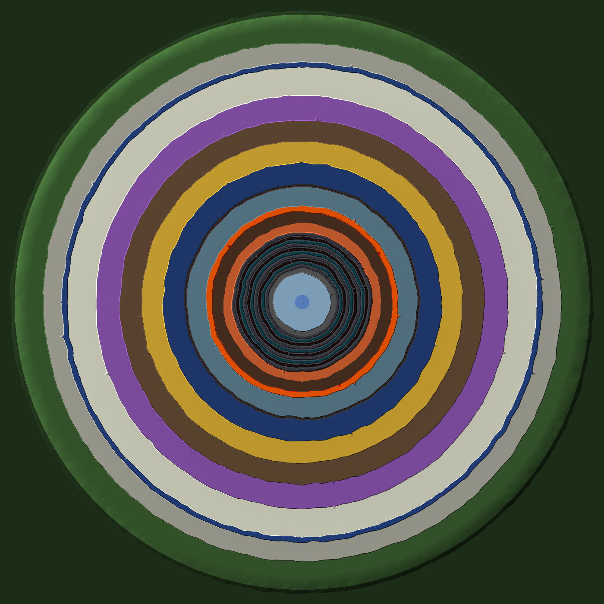
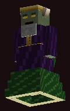
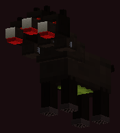
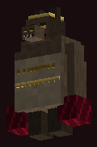
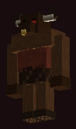
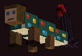
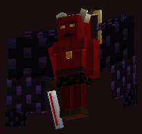
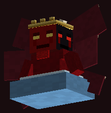

# Hellcraft

**Lasciate ogne speranza, voi ch'intrate.**

A server-side Fabric mod for Minecraft **1.21.1** and **26.3** that reshapes the overworld into Dante's *Inferno*. The world is a funnel of nine circles terracing down to frozen Cocytus. The rules are Lifesteal SMP, where **blood is fuel** and **hell is full**.

Players join with a **plain vanilla client**. The mod adds no blocks and no items; everything is made from vanilla blocks, mobs, particles and sounds.



## Play it in single player

Grab the newest **"Hellcraft … (test build)"** from the repo's [Releases page](https://github.com/the-small-things/hellcraft/releases). Every file comes twice, once per Minecraft version: pick the ones ending in `-mc1.21.1` or `-mc26.3`.

- **Modrinth App, Prism Launcher, ATLauncher or CurseForge (easiest):** download `Hellcraft-<version>-mc<minecraft>.mrpack` and import it as a modpack. That installs the right Minecraft, Fabric Loader and Fabric API for you.
- **Official Minecraft Launcher:** download `hellcraft-<version>-mc<minecraft>-mods.zip` and follow the `INSTALL.txt` inside. In short:
  1. Install Fabric Loader for that Minecraft version with the [Fabric installer](https://fabricmc.net/use/installer/).
  2. Put both jars in `.minecraft/mods`.
  3. Play the `fabric-loader-<minecraft>` profile.

Then go to **Singleplayer → Create New World → World tab** and click **World Type** until it says **Inferno**. On the **Game** tab, turn on **Allow Commands** if you want the test commands below.

### Testing solo

| Command | What it does |
|---|---|
| `/hellcraft goto <zone>` | Teleport to any zone (tab-completes). For example `limbo`, `greed`, `walls_of_dis`, `malebolge_pitch`, `judecca`. |
| `/hellcraft gate` | Back to the Gate of Hell |
| `/hellcraft giveheart @s 5`, `/hellcraft givefragment @s 8` | Blood to test with (right-click to use) |
| `/hellcraft sethearts @s 1`, then die | Test elimination: you become a ghost and your revenant rises |
| `/hellcraft revive <yourname>` | Come back from being a ghost |

The Gate of Hell has an altar next to it for trying the rites. To test PvP lifesteal, open the world to LAN and bring a friend.

## Hosting a server (Docker)

1. Download `hellcraft-<version>-mc1.21.1.jar` (or `-mc26.3.jar`) from the [Releases page](https://github.com/the-small-things/hellcraft/releases), or build it yourself with `./gradlew build` (the jar ends up in `build/libs/`).
2. Put the jar in `docker/mods/`.
3. From the `docker/` folder, run:

   ```sh
   docker compose up -d
   ```

The compose file uses [`itzg/minecraft-server`](https://github.com/itzg/docker-minecraft-server) with `TYPE=FABRIC` and `VERSION=1.21.1`. It downloads Fabric API automatically and creates the world with `LEVEL_TYPE=hellcraft:inferno`.

**Running 26.3 instead:** use the `-mc26.3` jar, set `VERSION: "26.3"` and change the image to `itzg/minecraft-server:java25` (26.x needs Java 25). Both lines are marked in `docker/docker-compose.yml`. Players then join with a vanilla 26.3 client.

> The Inferno only generates in a **new world**. If you already have a world, stop the server and delete (or move) `docker/data/world` first. Lifesteal still works on an old world, but the land won't change.

Already running itzg? Add these to your existing container:
- env `TYPE=FABRIC`, `VERSION=1.21.1` (or `26.3` on the `java25` image), `MODRINTH_PROJECTS=fabric-api` and `LEVEL_TYPE=hellcraft:inferno`
- the jar, mounted into `/mods`

You need `LEVEL_TYPE=hellcraft:inferno` (`level-type=hellcraft:inferno` in `server.properties`). Without it the world generates as a normal overworld, and only the lifesteal rules apply.

## The shape of Hell

The world is a disc 12,000 blocks across, with the world border at radius 6000. You spawn at the rim, just outside the **Gate of Hell**: a black wall that rings the whole Vestibule and Acheron. It is crowned with towers of soul fire and pierced by 12 gates, each bearing Dante's inscription. Every gate opens onto a slope down into the Vestibule. Walking toward 0,0 always leads down. Each circle sits on a terrace below the last, separated by cliffs. Every cliff has a few *ruined slopes* (ramps) cut into it, so you'll need to find them, or bridge and pillar your way down.

| Ring | Circle | Land | Its torment |
|---|---|---|---|
| Dark Wood | – | Dark oak forest rising into mountains at the border. Animals, wolves, and (on 26.3) only a few monsters, so new players can find their feet. The Gate of Hell's wall runs along its inner edge. | – |
| Vestibule & Acheron | – | Grey gravel plain. The river Acheron. Bees stand in for the stinging wasps. | – |
| **Limbo** | I | Pale meadows of calcite and birch. The only villages in Hell, plus trail ruins. | none: Limbo is only longing |
| **Lust** | II | Jagged tuff and deepslate spires with amethyst and crying obsidian. Breezes. | Hurricane gusts hurl you sideways |
| **Gluttony** | III | Mud, mangrove roots, filthy pools. Hoglins and slimes. | Constant Hunger |
| **Greed** | IV | Blackstone, gilded blackstone and raw gold. Boulders, piglins, buried bastions. | Carrying gold, diamonds, emeralds or netherite slows you |
| **Wrath** | V | The marsh of Styx. Drowned, and vindicators with Strength. | Weakness and Mining Fatigue while in its water |
| Walls of Dis | – | A ring wall of blackstone brick with burning towers and 4 gates. | – |
| **Heresy** | VI | Soul sand and basalt, with fields of burning open tombs. Blazes, wither skeletons. | Pulses of Darkness |
| **Violence** | VII | Phlegethon, a river of lava with crimson banks, where skeleton "centaurs" ride skeleton horses. The Wood of the Suicides (leafless trees, webs). The Burning Sands. | Breaking the trees hurts you. Fire rains on the sands. |
| **Fraud** | VIII | Malebolge: 10 concentric ditches crossed by 12 stone bridges. The ditch floors are pitch (magma and lava deltas) or blight (sculk). Ancient cities lie below. | 25% of monsters are invisible (26.3: 20%, never creepers, and they give themselves away with a swirl of particles) |
| Well of Giants | – | Nimrod, Ephialtes and Antaeus stand chained. | – |
| **Treachery** | IX | Cocytus, a frozen lake of packed and blue ice. At the very centre is Lucifer's pit. | Freezing cold that gets worse toward the centre. Leather armor protects, as in vanilla. |

At the bottom of the world waits **Lucifer** (see [below](#lucifer)).

**Supplies (26.3).** The Dark Wood is where pilgrims get ready: villages (plains and taiga, with farms, fletchers and librarians) and wandering traders are found there as well as in Limbo. Sugar cane grows by the water in the Dark Wood, the Acheron, Limbo, Gluttony and the Styx, and the Acheron's banks have sand. Loot worth the detour:
- **Virgil's Rests** ([below](#virgils-rests-263)): a supply chest at every circle's way in
- **Ruined Blood Altars** (twice as common as before): arrows, books, a Vigil Candle, sometimes an enchanted book
- **Heretics' tombs**: one in four hides a chest of forbidden books (enchanted books of level 15-30, paper, lapis, bottles o' enchanting)
- **Circle guardians**: 2 Blood Hearts, fragments, a Soul Anchor, 2 level-30 enchanted books and more

Some other rules of Hell:
- It is always dusk, so monsters never burn.
- Beds explode and respawn anchors don't work.
- Monsters get tougher the deeper you go.
- The monster mob cap is 1.75× vanilla on 1.21.1 (vanilla on 26.3, where the circles are gentler; see [the torments](#the-torments-of-the-circles)).
- Titles announce each circle as you enter it.
- Each circle has its own ambience (26.3): the wasps of the Vestibule, Charon's oar on the Acheron, the sighs of Limbo, the hurricane of Lust, rain in Gluttony, chinking gold in Greed, the bubbling Styx, crackling tombs, boiling blood, far-off screams in Malebolge and creaking ice in Cocytus. Turn it off with `circleAmbience`.

## Blood is fuel

New players start with 5 bread, 2 **Vigil Candles** (26.3) and **The Pilgrim's Guide** (26.3), a book by Virgil explaining hearts, blood, reviving, the circles, the weapons, the spines and Lucifer. Its numbers follow your config. `/guide` gives another copy.

**Hearts show next to every name in the player list** (26.3). Once someone has cast Lucifer down, a **Hall of the Damned** sidebar lists every slayer and how many times they won. Toggle these with `tabListHearts` and `sidebarHall`.

- **Hearts.** You start with 10 hearts and can hold up to 20.
  - Killing a player steals one of their hearts.
  - **26.3: only players take hearts.** Dying to monsters, lava, falls or the circles costs your items and XP like vanilla, never a heart. Set `pveDeathsCostHearts` to bring back the old rule.
  - 1.21.1 (or with `pveDeathsCostHearts`): dying to anything else costs a heart too, and it drops as a **Blood Heart** where you fell, so you can go back for it.
- **Blood Heart** (a glinting *fermented spider eye*). Right-click to gain a heart. `/withdraw [n]` turns your own hearts into Blood Hearts you can trade.
- **Blood Fragment** (a named *red dye*). Hostile mobs killed by players drop fragments. The chance rises from 5% in the outer circles to about 19% in Cocytus (26.3; 2% to 12% on 1.21.1). Right-click with 8 in one stack (`fragmentsPerHeart`) to clot them into a Blood Heart.
- **A way back (26.3).** Two one-time respawn items:
  - **Vigil Candle** (craft: torch + bone + string). Right-click to light it where you stand. Your next death wakes you beside it, then it's gone. One lit candle at a time.
  - **Soul Anchor** (every circle guardian drops one; rare in deep loot). Carry it. If you die, you rise again at the last solid ground near where you fell, with a few seconds of protection, and it breaks. Your dropped items are right there.
  - Neither works in Lucifer's pit. On respawn the anchor goes first, then the candle, then a bound altar.
- **Boss rewards.** The Wither gives 1 Blood Heart, the Warden gives 1 and the Ender Dragon gives 2. Lucifer has his own rewards (below).

### Blood altars

An altar is a **respawn anchor on a 3×3 of crying obsidian**. There is one at the Gate of Hell, and ruined altars with loot chests are scattered through Hell. You can build your own, too.

**26.3:** right-click an altar with an empty hand to open its menu. It shows every ghost's head (click one to revive them) plus the Ward and Bind rites. The Gate's altar has a sign saying so.

| Rite | How | Cost | Effect |
|---|---|---|---|
| **Revive** | Menu: click the ghost's head. Or stand by the altar and type `/revive <name>`. Or use a Name Tag renamed to their name. | 4 Blood Hearts | The ghost rises on top of the altar with 3 hearts |
| **Ward** | Menu, or use a Blood Heart on the altar | 1 Blood Heart | 30 minutes of immunity to every circle's torment, plus Regeneration and Absorption |
| **Bind** | Menu, or sneak and use a Blood Heart on the altar | Free on 26.3 (`bindCostHearts`); 1 Blood Heart on 1.21.1 | You respawn at this altar (beds explode, so this and the respawn items are how you move your spawn) |

(On 1.21.1 there is no menu: use the Name Tag and Blood Heart shortcuts.)

### Hell weapons (26.3)

Three vanilla tools, reforged with Blood Fragments at a crafting table. They're in everyone's recipe book, and swinging them costs nothing:
- **Passive**: every fully charged hit does something extra (below).
- **Blood charge**: charged hits on monsters (and players) add 5%, kills add 20%. The action bar shows the meter, and the weapon glows when it's full. **Right-click at 100%** to unleash its **Blood Art**. You lose the charge when you die.
- **Blood Oath**: sneak and right-click (in the air or at a block) to pay **3 hearts of health** (not max hearts) for a full charge and **30 seconds of full power**. It needs more than 4 hearts of health, and your blood takes 3 minutes to recover before the next oath.

| Weapon | Recipe | Passive (charged hits) | Blood Art (right-click at full charge) | Blood Oath |
|---|---|---|---|---|
| **Bloodletter** (sword) | iron sword + 4 Blood Fragments | 3 s of bleeding (Wither), heals you ½❤ | **Exsanguinate**: lunge 6 blocks, cutting everything in your path for 8 with deep bleeding, healing 1❤ per foe | +10 damage, deep bleeding, each hit heals you 1❤ |
| **Reaper of Minos** (scythe) | diamond hoe + 6 Blood Fragments | cleaves everything within 3 blocks of the target for 4 | **Harvest**: everything within 5 blocks takes 12, slowed and dragged toward you | every hit is a Harvest around the target |
| **Tithe Axe** | diamond axe + 6 Blood Fragments | kills drop Blood Fragments twice as often | **Blood Frenzy**: Strength II, Speed II and Haste II for 15 s | Strength III, Speed II, Resistance, hits heal 1❤ |

The Reaper's cleave never touches villagers, pets, the mount you're riding, or players you couldn't hit anyway (PvP off, same team).

`/hellcraft giveweapon <player> <bloodletter|reaper_of_minos|tithe_axe>` hands one out for testing.

### Blood armour (26.3)

Four pieces of diamond armour reforged with blood at a crafting table. They're in everyone's recipe book: each is the diamond piece plus 4 Blood Fragments.

They protect like diamond, look like crimson plate with bone rivets and burning eye slits (from the resource pack), and work as a set:
- **2 or more pieces:** your melee hits heal you 5% of the damage they deal.
- **All 4:** 10%, plus a **Blood Rush** (Regeneration II for 5 s) when you drop below 3 hearts of health, once a minute. A Blood Oath also gives you Resistance while it lasts.

`/hellcraft givearmour <player>` hands out a set for testing.

## The circle guardians (26.3)

On the straight road in from the Gate of Hell (the +X axis, z = 0), five of Dante's monsters wait in lairs ringed with soul-fire braziers, each with a sign. Walk into a lair and its guardian wakes. It gets a title card, a boss bar and its own model from the resource pack, and each extra player in the lair gives it +50% health. Every attack is telegraphed, and the action bar tells you how to dodge it:

| Guardian | Lair | Attacks |
|---|---|---|
| **Minos**, Judge of the Damned | Lust, x 4050 | *Tail of Judgement*: his tail sweeps the ground in a full circle (jump it). *Sentence*: a ring follows one player, then the hurricane tears up where they stand (keep moving). *Coil*: drags the nearest player into his coils until the others deal him 15 damage. |
| **Cerberus**, the Great Worm | Gluttony, x 3575 | Hunts like a ravager. *Three Maws*: three bites in a cone in front (get behind him). *Filth*: puddles of mud that slow and sicken. *Howl*: stuns everyone close. |
| **Plutus**, the Great Enemy | Greed, x 3125 | *Weight of Gold*: gold rain that hits harder the more gold you carry. *Lunge*: a golden line, then he hurls himself along it. *Pape Satàn*: a shriek that scatters and sickens. |
| **The Minotaur**, Infamy of Crete | Burning Sands, x 1600 | *Charge*: tramples along a burning line. *Stomp*: a ground shockwave (jump it). Below ⅓ health he goes berserk. |
| **Geryon**, Image of Fraud | edge of the great cliff, x 1480 | Flies and swoops. *Sting*: a red ring follows a player, then he drops onto it, tail first (poison and wither). *False Face*: vanishes, reappears elsewhere, and leaves three frauds (vexes) behind. |

A slain guardian drops **2 Blood Hearts** and 3–6 Blood Fragments, and sleeps for 30 minutes. If everyone leaves its lair, it goes back to sleep at full health. Config: `guardians`, `guardianRespawnMinutes`, `guardianHealthMultiplier`, `guardianHearts`. Ops can use `/hellcraft guardian <name> summon|slay|stop|status|attack <attack>`.

| Minos | Cerberus | Plutus | The Minotaur | Geryon |
|---|---|---|---|---|
|  |  |  |  |  |

## Lucifer

*"Another soul crawls to the bottom of the world."*

### The Emperor's Spines (26.3)

*"Nothing will touch thee on this road. I want thee WHOLE when thou arrivest."*

The road to Lucifer is a quiet one. At each point of the compass on the **rim of the Well of Giants**, a colossal backbone leaves the cliff and runs toward the centre of Hell. They start 660 blocks out at y −13: east (660, 0), south (0, 660), west (−660, 0) and north (0, −660). `/hellcraft spine [north|east|south|west]` takes an op there.
- For almost 500 blocks it hangs over **Cocytus**, 25 blocks above the frozen lake, with ribs curling down into the dark and soul lanterns along the way.
- Over **Judecca** it becomes a long **staircase**, one step down every four blocks, all the way to the rim of Lucifer's pit.

**No enemies.** Nothing hostile can exist on or near a spine, or anywhere in Judecca. The freezing of the ninth circle spares you while you walk it. The only company is a heartbeat that quickens the deeper you go, ash drifting in the dark, and **Lucifer's voice from far below**, a new line at every stretch of the descent.

The first time you reach the Well of Giants or Cocytus, chat tells you where the nearest spine starts. Their bones can't be broken. Worlds made with just the east spine get the other three on their next start.

### The fight

Walk into the pit at the centre of Judecca and the ice closes behind you. This is a scripted, three-phase fight with spoken dialogue, inspired by ULTRAKILL's 3-2.

**The pit can't be broken.** Its ice (the floor, the seal and the pillars) can't be mined except in creative. Anything you build down there you can still take away. On 26.3, whatever explosions or the Emperor blow out of the pit during the fight freezes back within half a second.

1. **The Fallen Seraph.** Lucifer is a towering, sword-wielding fallen angel who taunts you and fights like a duelist:
   - he teleports behind you
   - he sends lines of judgement fangs across the ice
   - his wings blast the pit with freezing wind
   - he calls hellfire down wherever flames mark the ground

   Every attack is telegraphed, so watch for it and dodge.
2. **The Morning Star.** At half health he snaps. He gets faster, glows, chains his attacks together, and raises the three great traitors he chews on for eternity to fight beside him.
3. **The Three-Faced Emperor.** Break his seraph form and he reveals his true face. On 26.3 he is Dante's Lucifer: frozen to the chest in the ice at the centre of the pit, so he can't move, but his reach is the whole pit. Each of his three faces turns toward its victim when it strikes. The action bar tells you how to survive each attack the first time you see it:
   - **Hatred** (red face): rings of fire sweep out across the ice, one after another. *Jump them.*
   - **Impotence** (pale yellow face): he weeps, frost rings mark where the tears will land, and they fall as ice. *Get out of the rings.*
   - **Ignorance** (black face): the light goes out, and a turning spiral of jaws sweeps out of the dark.
   - **The six wings**: a freezing gale drives everyone out toward the wall. *Sneak to brace yourself.*
   - **The mouths** (below ⅔ health, when "the ice cracks"): he drags someone to his jaws and chews. *Everyone else must hurt him to make him let go.*
   - Below ⅓ health **all three faces rage together**. Attacks come faster, rings of hatred run under his other attacks, and Judas, Brutus and Cassius crawl out of his mouths to fight for him.

   He still fires wither skulls between attacks.

**Returning champions make him harder.** For every player in the fight who has beaten him before, he gets tougher for *everyone* in that round:
- +35% health on both forms
- +20% damage
- attacks come faster
- extra fang lines and hellfire
- an extra traitor

With two or more champions, the traitors rise from the start. He calls champions out by name, and their difficulty shows as ✦ on his health bar.

**Rewards: pick ONE.** When he falls, every fighter still **alive in the pit** gets a chest-style menu (reopen it any time with `/lucifer reward`). There are no spoils for those who died before he did.
- **First victory:** pick one of
  - *Wings of the Morning Star* (Elytra)
  - *Morning Star*, a netherite sword with Sharpness V, Fire Aspect II, Looting III, Unbreaking III and Mending
  - 2 Totems of Undying
  - 2 Enchanted Golden Apples
  - 4 Blood Hearts
  - **Lucifer's Bane**
- **Later victories:** pick a Totem of Undying, an Enchanted Golden Apple, or 2 Blood Hearts.

### The climb out: Purgatory (26.3)

*"Thence we came forth to rebehold the stars."*

When Lucifer falls, a **burrow** (an end gateway) opens in the ice where he was frozen, for five minutes. Step in and you climb out onto the shore of **Purgatory**, a mountain island floating high above the pit (y 226–290) under the eternal night sky:
- **Seven terraces** spiral up the mountain, one for each capital sin, with stairways cut into the cliffs. Each has a sign, and at each new terrace an angel's wing erases a P from your brow.
- The **Earthly Paradise** on the summit has flowers and trees and two streams:
  - **Lethe** (west) washes away every harmful effect, fire and frost.
  - **Eunoë** (east) gives +2 hearts (up to your cap) and a full heal, once for every victory over Lucifer.
- The **Gate of Return** in the middle of the garden takes you back to the Gate of Hell.
- Fall off the mountain and an angel catches you and sets you down on the shore.

`/hellcraft purgatory` takes an op to the shore.

**Lucifer's Bane** (a glowing nether star) permanently raises your heart cap by 2 when you right-click it. It's an item, so it can be traded, and each one you consume adds another +2.

### Lucifer's look (26.3)

On 26.3 Lucifer has his own models: the **Fallen Seraph** (horned, crimson, black-winged, with a broken halo and a bloodied blade) and then the **Three-Faced Emperor** (red, pale and black faces, six bat wings, shards of the ice he's frozen in). Blood Hearts, Fragments and Lucifer's Bane get their own art too. They come from the Hellcraft resource pack (below).

| Fallen Seraph | Three-Faced Emperor |
|---|---|
|  |  |

### Boss music

The fight has music: a different track for the duel, the enraged phase and the true form. Everyone hears vanilla music discs by default ("Creator", "Pigstep" and "Precipice"). To use **your own tracks**:
1. Export them as **Ogg Vorbis** (`.ogg`). Audacity can do this: File → Export → Ogg.
2. Name them `duel.ogg`, `enraged.ogg` and `true_form.ogg`. Any subset works; a missing phase reuses another track.
3. Put them in `config/hellcraft/music/`:
   - Docker: `docker/data/config/hellcraft/music/`
   - single player: `.minecraft/config/hellcraft/music/`
4. Restart. The tracks go into the Hellcraft resource pack.

### The Hellcraft resource pack

**Servers** send players one resource pack when they join. It holds Lucifer's models, the hell weapons, the blood items (26.3) and your boss music. Minecraft caches it, so players download it **once**, and again only when it changes. On 26.3 it's **required**: players who decline can't join, because Lucifer would be invisible to them. Set `"resourcePackRequired": false` in the config to make it optional.

**No setup needed on 26.3.** Each player is sent the pack from the address they joined with (`play.example.com`, your IP, a LAN address...), on port **25566**. That port must be open and forwarded just like 25565; the compose file already maps it.
- Behind a proxy (Velocity, TCPShield...) or with a different download address: set `"musicPackHost"` in `config/hellcraft.json` or `HELLCRAFT_PACK_HOST`. 1.21.1 still needs one of these.
- **Tunnels like playit.gg** only forward the game port. Players who join through a playit.gg address automatically get the copy of the pack that each release publishes on GitHub (`hellcraft-pack-<version>-mc26.3.zip`), so there's nothing to set up. That copy has no custom boss music. `"packFromGitHub"` can be `"auto"`, `"always"` or `"never"`.
- If your host only allows one port, upload the pack somewhere and set `"musicPackUrl"` to it, or use `"packFromGitHub": "always"`.

Operators get a reminder in chat when they join if the pack can't be sent.

**Single player** needs no setup: the art is built into the mod.

He returns 2 hours after a defeat. If everyone in the pit dies or flees, he mocks them and returns after 5 minutes. Health, cooldowns, champion scaling, the Bane bonus and the fallback music are all in the config.

His dialogue appears in chat, each line with a low voice cue.

Testing it: `/hellcraft lucifer summon` teleports you to the pit and wakes him. `/hellcraft lucifer status` shows the fight's state. Play in **survival**, because he ignores creative players. `/hellcraft lucifer skip` jumps to the next phase, and `/hellcraft lucifer stop` ends the fight.

## Virgil's Rests (26.3)

Where the ramps come down into each circle (Limbo, Lust, Gluttony, Greed, the Styx, Heresy, the Wood of Suicides, the Burning Sands and Malebolge) stands a **Virgil's Rest**, 26 in all:
- a free **Blood Altar** to bind your respawn to
- soul campfires, and a **supply chest** with arrows, food, torches, books, paper, sugar cane, Vigil Candles and enchanted books. Deeper Rests hold better loot: diamonds, Fire Resistance, and sometimes a Soul Anchor.
- a safe ring (20 blocks): no circle torments you there, monsters don't spawn, and any that wander in are thrown back out.

They are built the first time someone comes near. Entering a circle, and `/circle`, tell you where the nearest Rest is.

**Travel.** Every Rest you step into is remembered. Right-click **any Blood Altar** (a Rest's, the Gate's, or one you built) and click **Travel** to go back to the Gate of Hell or any Rest you've reached. You still have to walk down to a new circle the first time. It's free, but you can only travel once every 2 minutes (`travelCooldownSeconds`; `travel: false` turns it off).

## The torments of the circles

Each circle torments the living (26.3: each has a counter, and the first time it touches you, Virgil tells you what it is). A Blood Ward suspends them all.

| Circle | Torment | Counter (26.3) |
|---|---|---|
| Lust | The wind throws you about under the open sky | Sneak, or get under a roof |
| Gluttony | The rain brings Hunger | A roof |
| Greed | Gold you carry slows you | Stash it (ender chest) |
| Wrath | The Styx's water weakens you | A boat, or the banks |
| Heresy | The tombs' smoke brings Darkness now and then | A roof |
| Burning Sands | Fire rains on the open sand (you see it falling first) | A roof, water, Fire Resistance, or leaving the sand |
| Fraud | Some monsters are invisible | Watch for their swirl of particles (never creepers) |
| Treachery | The ice freezes you | Leather armour, or a campfire, fire or lava within 4 blocks |

The monsters are tougher the deeper you go (+3% health per circle on 26.3). On 26.3 the Vestibule, Acheron and Limbo also have sparse, solitary spawns like the Dark Wood, and the monster cap is vanilla's.

## Hell is full

When you lose your last heart you are not banned. *There is no more room in hell*:
- You become a **ghost**, a spectator tethered to where you died.
- Your corpse rises as a **revenant**. It's a zombie (drowned, husk or stray depending on the circle) with your name, wearing your head and the armor and weapon you died with. Kill it to get your gear back.
- The living can buy you back at a blood altar. Everyone gets step-by-step instructions in chat when someone becomes a ghost, and `/revive` repeats them and lists who is dead (26.3).

**How to revive a friend (26.3):**
1. Get **4 Blood Hearts**. `/withdraw` turns your own hearts into Blood Hearts; kills and 8 clotted Blood Fragments give more.
2. Go to a **Blood Altar**. There's one beside the Gate of Hell, and `/revive` tells you its coordinates.
3. **Right-click it with an empty hand** and click your friend's head. They rise on the altar with 3 hearts, even if they are offline (they come back when they next join).

**Ghost powers (26.3).** Ghosts aren't just spectators:
- `/ghost mark`: whatever you're looking at (up to 32 blocks) glows for everyone for 10 s. Cooldown 30 s.
- `/ghost haunt`: whoever or whatever killed you, if within 48 blocks, gets 6 s of Darkness and Slowness and feels your breath on their neck. Cooldown 2 min.
- `/ghost beacon`: a 24-block pillar of soul fire rises over you for 30 s, and chat tells everyone where you are, so friends can find you. Cooldown 1 min.

## Commands

| Command | Who | |
|---|---|---|
| `/hearts [player]` | all | Show hearts |
| `/withdraw [n]` | all | Bleed hearts into Blood Hearts |
| `/circle` | all | Where am I in Hell? |
| `/revive` | all | How reviving works, who is a ghost, and where the nearest altar is (26.3) |
| `/revive <name>` | all | Revive a ghost while standing next to a Blood Altar, paying the Blood Hearts (26.3) |
| `/guide` | all | Get a copy of The Pilgrim's Guide (26.3) |
| `/ghost mark\|haunt\|beacon` | ghosts | Ghost powers (26.3) |
| `/hellcraft sethearts <player> <n>` | op | |
| `/hellcraft giveheart\|givefragment <player> [n]` | op | |
| `/hellcraft revive <name>` | op | Revive a ghost without an altar |
| `/hellcraft ghosts` | op | List ghosts |
| `/hellcraft goto <zone>` / `gate` / `spine [way]` | op | Teleport to a zone / the Gate / the start of the Emperor's Spine (testing) |
| `/lucifer reward` | all | Open your Lucifer reward chooser (if you have one waiting) |
| `/hellcraft lucifer summon\|skip\|stop` | op | Start, advance or end the Lucifer fight (testing) |
| `/hellcraft givebane <player> [n]` | op | Give Lucifer's Bane |
| `/hellcraft giveweapon <player> <weapon>` | op | Give a hell weapon (26.3) |
| `/hellcraft giveitem <player> vigil\|anchor` | op | Give a Vigil Candle or Soul Anchor (26.3) |
| `/hellcraft givearmour <player>` | op | Give a set of blood armour (26.3) |
| `/hellcraft guardian <name> summon\|slay\|stop\|status\|attack <a>` | op | Test a circle guardian (26.3) |
| `/hellcraft purgatory` | op | Go to the shore of Purgatory (26.3) |
| `/hellcraft shrine list\|build [circle]` | op | List the Virgil's Rests, or build them now instead of when someone comes near (26.3) |
| `/hellcraft shrine visit <player> <rest\|all>` | op | Let a player travel to a Rest without walking there (26.3) |
| `/hellcraft travel <player> <gate\|rest>` | op | Send a player to the Gate or a built Rest, ignoring the cooldown (26.3) |
| `/hellcraft lucifer attack <slash\|fangs\|wings\|hellfire>` | op | Make him use one attack |
| `/hellcraft lucifer attack <hatred\|impotence\|ignorance\|wingbeat\|mouths>` | op | Make the Emperor use one attack (26.3, true form) |
| `/hellcraft where` | op | Debug: geometry at your position |
| `/hellcraft reload` | op | Reload `config/hellcraft.json` |

## Config

`config/hellcraft.json` is created on first start. On 26.3 it carries a `configVersion`: when an update changes a default (1.1 made the circles gentler and blood easier to find), settings still on the old default move to the new one, and values you chose yourself are kept. You can change:
- start, max and revive hearts, and the revive cost
- fragment drop rates and how many fragments make a heart
- whether monsters and the world take hearts (`pveDeathsCostHearts`, 26.3) and whether such a heart drops where you fell
- what binding your respawn costs (`bindCostHearts`, 26.3)
- travel between altars (`travel`, `travelCooldownSeconds`, 26.3)
- the mob cap multiplier and mob health per depth
- the ghost tether radius
- ward length
- toggles for hazards, titles and revenants
- Lucifer's health (both forms), cooldowns and the heart-cap bonus
- the resource pack: `musicPackHost` / `musicPackPort` (where players download it from), `musicPackUrl` (host it yourself instead), and `resourcePackRequired` (26.3)
- the guide book, tab-list hearts, the Hall of the Damned and circle ambience (26.3): `guideBook`, `tabListHearts`, `sidebarHall`, `circleAmbience`
- Lucifer's models (26.3): `luciferModels` (false gives him his vanilla look back) and `luciferModelYawOffset` (degrees, if a model faces the wrong way)

## Development

- `./gradlew build` builds the 1.21.1 mod and runs the geometry unit tests.
- `versions/26.3` is the Minecraft 26.3 build (Java 25, Loom without remapping): `cd versions/26.3 && ./gradlew build`. It shares `InfernoGeometry`, `Circle`, `Zone`, the Ogg reader and the unit tests with the root project, so the shape of Hell is identical in both.
- `python3 tools/gen_worldgen.py` regenerates every biome, surface rule, feature and tag for 1.21.1; `python3 tools/gen_worldgen.py --26.3` writes the same world in 26.3's data formats. Edit the script, not the JSON.
- `tools/RenderMap.java` renders the map and cross-section in `docs/` without Minecraft (see its header for the command).
- `scripts/smoke-test.sh` boots a real server in Docker, generates every circle and checks the log. CI runs it on every push, on both 1.21.1 and 26.3 (`MC_VERSION`/`MC_IMAGE`).
- `scripts/package-singleplayer.sh` builds the `.mrpack` and the mods zip into `dist/`. CI runs it and publishes the results as the test pre-release.
- All of the funnel's geometry lives in `InfernoGeometry.java`, which is pure Java. Terrain, biomes, features and hazards all read from it.
